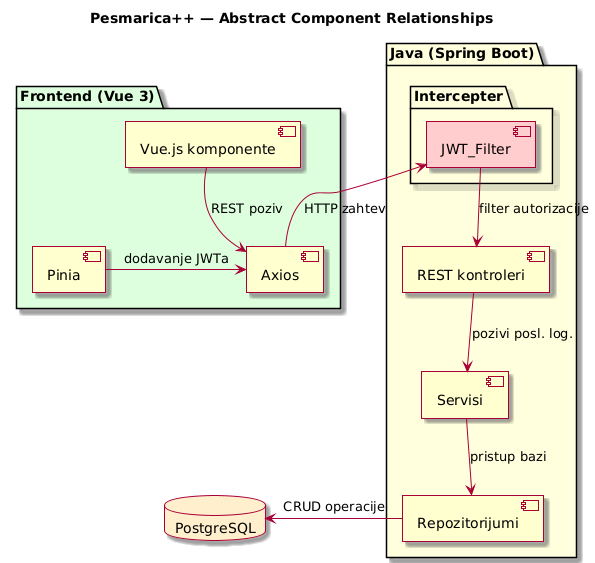
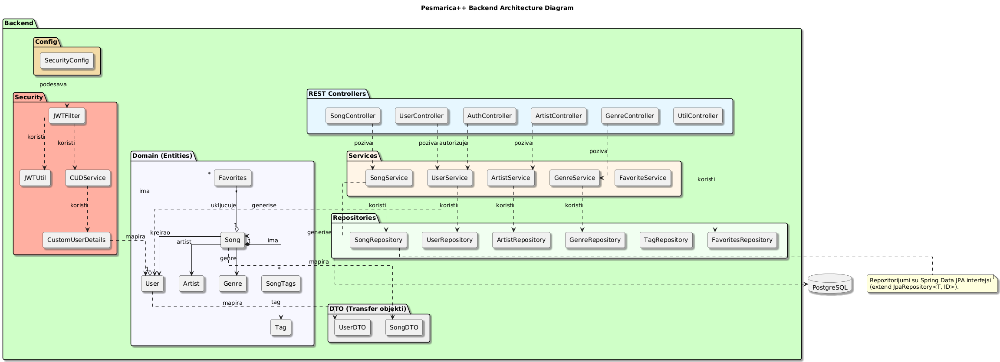

# NJT: Dokumentacija
Projekat podrazumeva razvoj digitalne platforme koja omogućava muzičarima (a specijalno gitaristima) svih nivoa znanja pristup
sveobuhvatnoj akorda i tablatura, uz interaktivne alate za učenje i vežbanje.
Aplikacija je dostupna u vidu web rešenja.

Sistem će obezbediti:
- Pretragu i pregled akorda i pesama uz vizuelne dijagrame
- Organizaciju i čuvanje omiljenih sadržaja
- Mogućnost doprinosa korisnika kroz dodavanje i uređivanje tablatura

## Tehnologije izrade

Za razvoj **klijentske** aplikacije korišćeni su sledeći alati:
- **JavaScript** i **Vue.js 3 (Composition API)**
- **Vue Router** za rutiranje
- **Pinia** za upravljanje stanjima
- **Axios** za komunikaciju sa serverom
- **Vite** za build
- **TailwindCSS** za stilizovanje UI-a

Za razvoj **serverske** aplikacije korišćeni su sledeći alati:

- Java sa Spring Boot 
- **Spring MVC** za REST
- **Spring Data JPA** i **Hibernate** za ORM
- **Spring Security** za autentifikaciju i autorizaciju
- **Maven** za Dependency management i lifecycle

Za skladištenje podataka odabran je **PostgreSQL** sistem za URBP. 

## Pregled sistema



## Pregled arhitekture serverske aplikacije


## Slučajevi korišćenja

| SK  | Naziv             |
|-----|-------------------|
| SK1 | Registracija |
| SK2 | Prijava |
| SK3 | Odjava |
| SK4 | Pregled pesama |
| SK5 | Pretraga pesama |
| SK6 | Dodavanje omiljenih pesama |
| SK7 | Brisanje omiljenih pesama |
| SK8 | Pregled profila |
| SK9 | Dodavanje transkripcija |
| SK10| Izmena transkripcije |
| SK11| Brisanje transkripcije |

U nastavku je dat detaljniji pregled nekih slučajeva korišćenja.

### SK 5: Pretraga pesama
- **Akteri**: Korisnik, Sistem
- **Preduslovi**: Baza pesama postoji i dostupna je.
- **Okidač**: Korisnik pretražuje pesmu ili listu pesama.

Glavni tok:
1. Korisnik otvara sekciju “Pesme”.
2. Korisnik pretražuje naslov pesme ili izvođača.
3. Sistem prikazuje rezultate pretrage.
4. Korisnik bira pesmu i gleda tablaturu i dijagrame akorda.
- **Postuslov**: Korisnik uspešno pregleda tablaturu i akorde izabrane pesme.

### SK 6: Čuvanje omiljenih pesama
- Cilj: Korisnik čuva pesme za kasniji pristup.
- Akteri: Korisnik, Sistem
- Preduslovi: Korisnik je prijavljen na svoj nalog.
- Okidač: Korisnik klikne na dugme “Sačuvaj”.
  
Glavni tok:
1. Korisnik otvara akord ili tablaturu.
2. Korisnik klikne na dugme “Sačuvaj”.
3. Sistem dodaje stavku u listu omiljenih.
4. Korisnik kasnije pristupa listi omiljenih iz svog profila.
- **Postuslov**: Pesma se nalazi u korisnikovoj listi omiljenih.


### SK 9: Slanje nove tablature
- **Cilj**: Korisnik dodaje novu pesmu ili akorde u bazu.
- **Akteri**: Korisnik, Sistem
- **Preduslovi**: Korisnik je prijavljen i ima potrebne dozvole.
- **Okidač**: Korisnik klikne na “Dodaj tablaturu”.

Glavni tok:
1. Korisnik zahteva predefinisane podatke za pesme (autori žanrovi i oznake)
2. Korisnik unosi podatke o pesmi (naslov, izvođač, akordi/tablatura).
3. Sistem proverava format i ispravnost podataka.
4. Nova pesma se dodaje u javnu bazu.
- **Postuslov**: Nova pesma je dostupna svim korisnicima i zabeležena na profilu korisnika.

## Hijerarhijski prikaz komponenata implementacije
```
src/main/
├── java
│   └── com
│       └── jelisavacl
│           └── njt
│               ├── config
│               │   └── SecurityConfig.java
│               ├── controller
│               │   ├── ArtistController.java
│               │   ├── AuthController.java
│               │   ├── GenreController.java
│               │   ├── SongController.java
│               │   ├── TagController.java
│               │   ├── UserController.java
│               │   └── UtilController.java
│               ├── dto
│               │   ├── SongDTO.java
│               │   └── UserDTO.java
│               ├── entity
│               │   ├── Artist.java
│               │   ├── Genre.java
│               │   ├── Song.java
│               │   ├── Tag.java
│               │   └── User.java
│               ├── NjtApplication.java (Entry point aplikacije)
│               ├── repository
│               │   ├── ArtistRepository.java
│               │   ├── GenreRepository.java
│               │   ├── SongRepository.java
│               │   ├── TagRepository.java
│               │   └── UserRepository.java
│               ├── security
│               │   ├── CustomUserDetails.java
│               │   ├── CustomUserDetailsService.java
│               │   ├── JwtFilter.java
│               │   └── JwtUtil.java
│               ├── service
│               │   ├── ArtistService.java
│               │   ├── AuthService.java
│               │   ├── GenreService.java
│               │   ├── SongService.java
│               │   ├── TagService.java
│               │   └── UserService.java
│               └── util
│                   └── EndpointLogger.java
└── resources
    ├── application.properties
    ├── application.yml
    ├── static
    └── templates
```